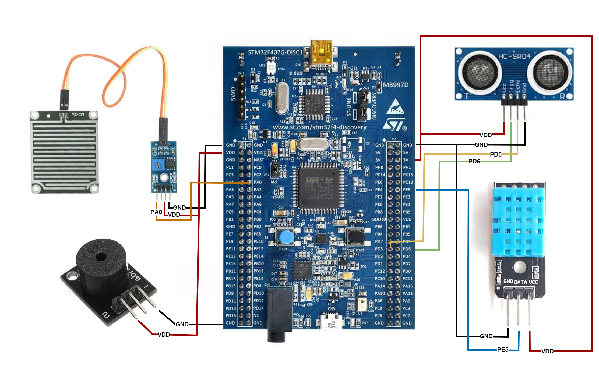

# Flood Warning System using FreeRTOS on STM32F4 Board

## Introduction

This project aims to develop a flood warning system using FreeRTOS on the STM32F4 board. The system uses various sensors to monitor environmental factors and alert users in case of flood risk.

## System Components

The system includes the following main components:

- **DHT11 Temperature and Humidity Sensor**: Measures the ambient temperature and humidity.
- **HC-SR04 Ultrasonic Sensor**: Measures the distance from the sensor to the water surface, helping to determine water levels.
- **Rain Sensor**: Detects the presence of rain.
- **Alarm Buzzer**: Alerts users when there is a flood risk.

## System Operation

1. **Data Collection**:

   - The **DHT11 sensor** measures the ambient temperature and humidity. This data is used to assess general weather conditions.
   - The **HC-SR04 ultrasonic sensor** continuously measures the distance from the sensor to the water surface. When this distance falls below a predefined threshold, the system determines that the water level is rising.
   - The **Rain Sensor** detects the presence of rain, providing information about the current weather conditions.

2. **Data Processing**:

   - Data collected from the sensors is processed by the STM32F4 microcontroller.
   - FreeRTOS manages the tasks of collecting and processing data from the sensors efficiently, ensuring smooth and continuous operation of the system.

3. **Alerting**:
   - When the sensor data indicates a flood risk (e.g., water level exceeds the safe threshold and/or heavy rain is detected), the system activates the alarm buzzer to notify the user.

## Directory Structure

FloodWarningSystem/
├── src/ # Contains the project source code
│ ├── main.c # Main program file
│ ├── dht11.c # DHT11 sensor driver code
│ ├── hcsr04.c # HC-SR04 sensor driver code
│ ├── rainsensor.c # Rain sensor driver code
│ └── buzzer.c # Alarm buzzer control code
│
├── include/ # Contains the header files
│ ├── dht11.h
│ ├── hcsr04.h
│ ├── rainsensor.h
│ └── buzzer.h
│
├── doc/ # Contains the project documentation
│ └── user_manual.md
│
├── FreeRTOSConfig/ # FreeRTOS configuration files
│ ├── FreeRTOSConfig.h
│ └── FreeRTOS.h
│
└── README.md # Project description file

## Diagram

  

## Flowchart Diagram

  

## Analysis Segger SystemView

  

## Embedded Requirements

- STM32F4 Board
- FreeRTOS
- Sensors: DHT11, HC-SR04, RainSensor
- Alarm Buzzer

## Software Requirements

- STM32CubeIDE: [STM32CubeIDE](https://www.st.com/en/development-tools/stm32cubeide.html)
- Hercules: [Hercules](https://www.hw-group.com/software/hercules-setup-utility)
- Arduino IDE: [Arduino](https://www.arduino.cc/en/software)
- MongoDB: [MongoDB](https://www.mongodb.com/try/download/community)

## Installation Instructions

1. Connect the sensors and alarm buzzer to the STM32F4 board according to the wiring diagram.
2. Download and install FreeRTOS on the STM32F4 board.
3. Download the project source code from the repository and upload it to the STM32F4 board.
4. Run the system and check the operation of the sensors and alarm buzzer.

## Contribution

If you would like to contribute to the project, please fork the repository and submit a pull request. We welcome any ideas and improvements from the community.

## Contact

If you have any questions or suggestions, please contact us via email: [tthanhete@gmail.com]
